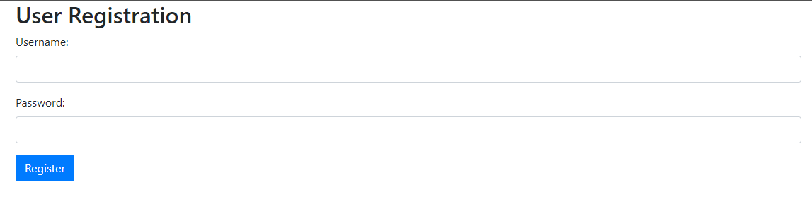
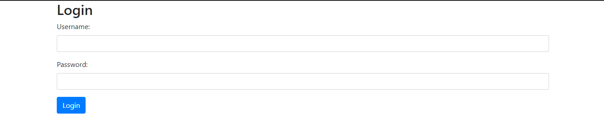
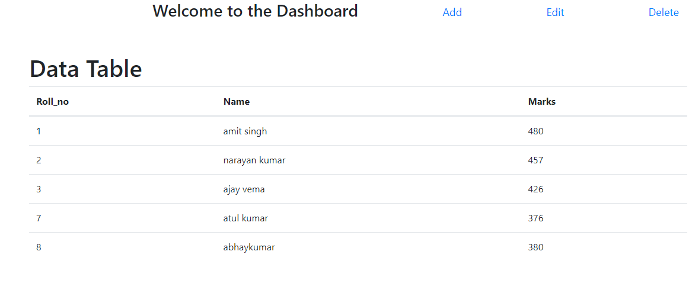
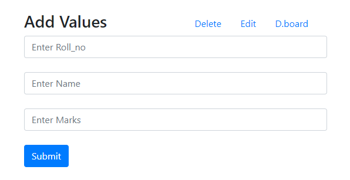
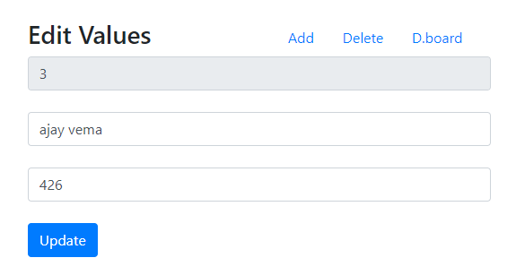
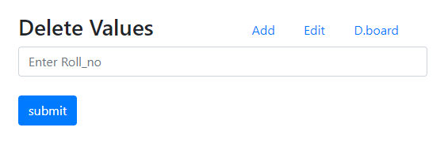

# cgiproject

##### This is a POC project for CRUD operations on school database.

### Technologies used:
- JavaScript
- CSS
- Html
- Bootstrap
- Python CGI
- SQLite Database
- Apache web server

#### Screenshots

## How to run the Project

