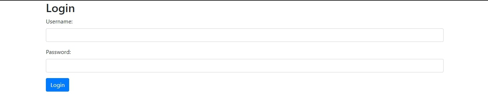
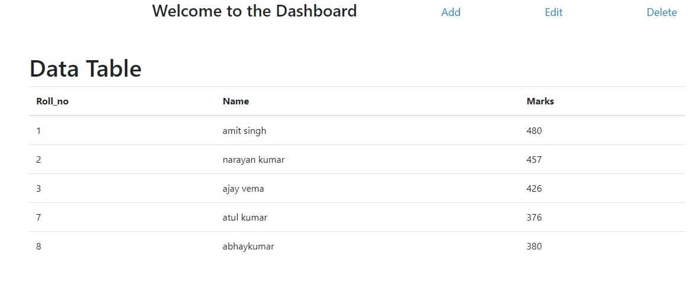
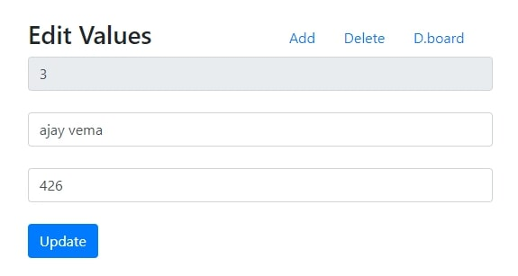

# cgiproject

##### This is a POC project for CRUD operations on school database.

### Technologies used:
- JavaScript
- CSS
- Html
- Bootstrap
- Python CGI
- SQLite Database
- Apache web server

#### Screenshots

## How to run the Project

- Locate the terminal to "cgi-bin" directory and the run "python create_table.py" to initialize the database and for table creation.
- Set permission so that CGI scripts have executable permission. Run the following commands:

      #### chmod +x cgi-bin/registration.cgi
      #### chmod +x cgi-bin/login.cgi
      #### chmod +x cgi-bin/dashboard.cgi
      #### chmod +x cgi-bin/add_edit_delete.cgi

- Run web server to run CGI scripts using "python -m http.server 8000 --cgi"
- Access website at localhost:8000

